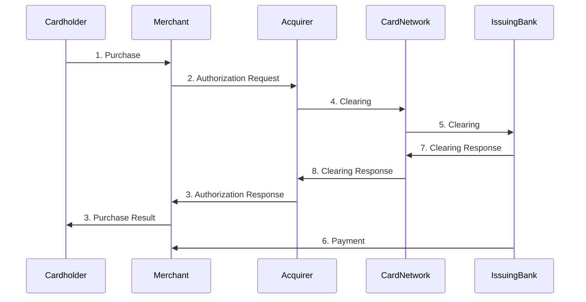

# cloudwalk-challenge

## Understand the Industry

Q - Explain the money flow and the information flow in the acquirer market and the role of the main players.
A - The flow starts when the cardholder uses the credit/debit card in a Merchant(via internet or by swiping the card), the Merchant then start the processing by sending the card and purchase information to the acquirer that relays that information to the card network(this step called Authorization can be done directly or using a payment gateway), the card network will check with the issuing bank if there is funds available to complete the request, after receiving green light from the issuing bank the card network informs the acquirer that relays this information to the Merchant. After the authorization is completed, the issuing bank moves the funds from the cardholder account to the Merchant account, if the transaction is using credit card, fees might be applied to expedite the payment.

Q - Explain the difference between acquirer, sub-acquirer and payment gateway and how the flow explained in question 1 changes for these players.
A - The main difference between the acquirer and sub-acquirer is that the sub-acquirer can act as an intermediary between the merchant and the acquirer, usually the implementation is easier because is fitted to small companies but that tends to have higher costs, the payment gateway usually is the first layer of integration between the customer store and an acquirer, in most cases are extremely simple to implement with libraries and well-documented apis and does not require too much development if you are using their libraries. If there is a payment gateway that utilizes a sub-acquirer two extra steps will be added because the sub-acquirer does not replace everything from the acquirer so is not eliminated in this case

Q - Explain what chargebacks are, how they differ from cancellations and what is their connection with fraud in the acquiring world.
A - Chargebacks happen when the customer does not recognize the transaction, they differ from cancellations because in the cancellation process, the customer recognizes the purchase and just wants to cancel, maybe because he did not like the product or something similar but he did the purchase. Chargeback can indicate that the  credit card is compromised so it is safe to assume following transactions for that account have a high risk of being fraudulent as well, so it must be rejected or at least validated using methods like 3D Secure validation, 

## Get your hands dirty
### Using this csv with hypothetical transactional data, imagine that you are trying to understand if there is any kind of suspicious behavior.
Q - Analyze the data provided and present your conclusions (consider that all transactions are made using a mobile device).
A - You can see that the same user has multiple transactions happening in a short period of time, most of them with chargebacks already, we have multiple transactions with high amount and some with a previous chargeback, there is a lot of transactions between 10pm~6am that in most cases are considered a red flag.
This is basically what is happening with a lot of transactions on that list
Q - In addition to the spreadsheet data, what other data would you look at to try to find patterns of possible frauds?
- Information about the user like email, address or any other way to identify the user.
- The industry for that payment to check if a transaction of that value in that time is valid or not
- The device fingerprint: in the csv we have a device ID, but would be nice to know more to see if it fits the pattern for that user
- The location from where that transaction started, you can use that to see if it fits the user pattern/known locations or if is too far away from the previous location
- If that transaction is recurrent

## Code challenge
  In order to run you will need to have redis-server running locally.
  To run the api you need to run `bundle exec rackup` the endpoints are:
  `POST /evaluate_transaction` that receives a JSON body:
  ```JSON
  {
    "transaction_id" : 10112211,
    "merchant_id" : 2971414,
    "user_id" : 970511111,
    "card_number" : "434505******9116",
    "transaction_date" : "2019-11-30T23:29:32.812632",
    "transaction_amount" : 123,
    "device_id" : 285475
  }
```
The response is the transaction with the status, the score or the rule that generated that result:

```JSON
{
    "transaction_id": 10112211,
    "merchant_id": 2971414,
    "user_id": 970511111,
    "card_number": "434505******9116",
    "transaction_date": "2019-11-30T23:29:32.812632",
    "transaction_amount": 123,
    "device_id": 285475,
    "status": "approved",
    "score": 40
}
```

`POST /chargeback` that receives a JSON body:
```JSON
{
"transaction_id" : 10112,
"user_id" : 9705111
}
```

The response is just `{ "status": ok } `


