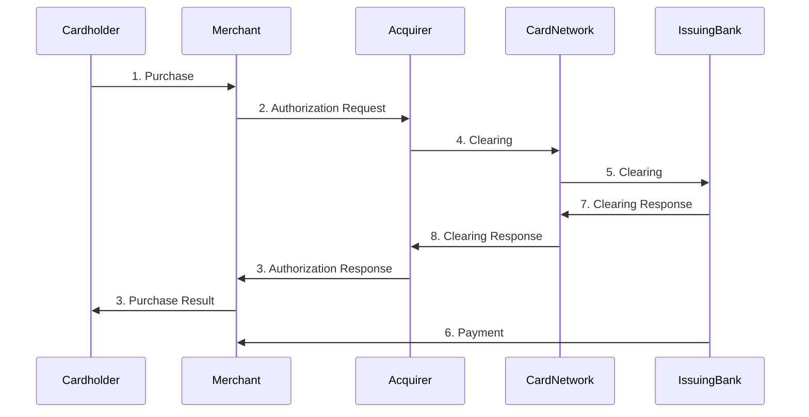

# cloudwalk-challenge

## Understand the Industry

Q - Explain the money flow and the information flow in the acquirer market and the role of the main players.
A - The flow starts when the cardholder uses the credit/debit card in a Merchant(via internet or by swiping the card), the Merchant than start the processing by sending the card and purchase information to the acquirer that relay that information to the card network(this step called Authorization can be done directly or using a payment gateway), the card network will check with the issuing bank if there is funds available to complete the request, after receiving green light from the issuing bank the card network informs the acquirer that relays this information to the Merchant. After the authorization is completed the issuing bank moves the funds from the cardholder account to the Merchant account, if the transaction is using credit card, fees might be applied to expedite the payment.

Q - Explain the difference between acquirer, sub-acquirer and payment gateway and how the flow explained in question 1 changes for these players.
A - 

Q - Explain what chargebacks are, how they differ from cancellations and what is their connection with fraud in the acquiring world.
A - Chargebacks happens when the customer does not recognize the transaction, they differ from cancellations because in the cancellation process the customer recognize the purchase and just want to cancell, maybe because he did not liked the product or something similar but he did the purchase. Chargeback can indicate that the  credit card compromised so is safe to assume following transactions for that account has a high risk of being fraudulent as well, so it must be rejected or at least validated using methods like 3D Secure validation.

## Get your hands dirty
### Using this csv with hypothetical transactional data, imagine that you are trying to understand if there is any kind of suspicious behavior.
Q - Analyze the data provided and present your conclusions (consider that all transactions are made using a mobile device).

Q - In addition to the spreadsheet data, what other data would you look at to try to find patterns of possible frauds?
A - 
- Informations about the user like email, address or any other way to identify the user.
- The industry for that payment, to check if a transaction of that value in that time is valid or not
- The device fingerprint, in the csv we have a device ID but would be nice to know more, to see if fits the pattern for that user
- The location from where that transaction started, you can use that to see if fits the user pattern/known locations or if is too far away from the previous location
- If that transaction is recurrent

